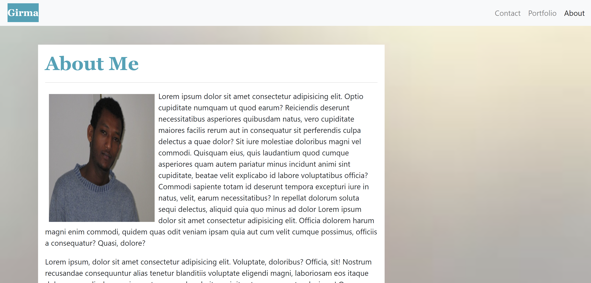

# Responsive-Portfolio
* view the [GitHub-repo](https://github.com/girmaD/Responsive_Portfolio)
* View the [depolyed application](https://girmad.github.io/Responsive_Portfolio/index.html)
___
## Table of contents
* Introduction
* Index.html
* Contact.html
* Portfolio.html
* Assets folder
    * CSS/style.css
    * Images
______
### Introduction
The Obejective of this project is to build a responsive portfolio website. The wesbite has three pages. Three html files render their respective pages. Each html files has been validated by html W3 validation services. The details of each html page is discussed below.

The website is made mainly with **Bootstrap**. Using Bootstrap grid system has made the pages responsive for different screen sizes. There are limited cases where I needed to inlude a **custom CSS**. However, Bootstrap is used thoughout the html files and the explanations of which is provided in the html files as html comments.

All files contain a responsive bootstrap **navbar** and **footer**. The Navbar contains nav-links that can be clicked to go to their respective pages of the website. the nav-links turn in to humburger on medium and smaller screen sizes, and expands on large and above screen sizes. Likewise, the footer is responsive on all screen sizes and contains social media links with font-awesome icons.

#### Sample Screen shot Image

### Index.html
The index.html files renders the about me page. The page contain an images that floats and text wraps it on the right and below. Bootstrap gird system is effeciently applied so that the page is responsive on all screen sizes. A snapshot of the page is provided below:

### Contact.html
The contact.html renders a way to contact me. Name, email and message is are required to make a successful contact.
### Portfolio.html
This page renders a portfolio composed of images. Bootstrap grid system is effectively applied to make the images web responsive for a variety of screen sizes. The images take two columns on large and above screen sizes. But on screen sizes on medium and smaller screen sizes - the images take one columns on each row.
### Assets folder
The Assets folder contains two sub-folders. The first one is the CSS sub-folder, which in turn contains style.css file. The style.css files accomplishes two major issues - making the footer positioned at the bottom of the page and on potfolio page only applying a media query on smaller screen conveyance. The second sub-folder is a images sub-folder. This sub-folder contains images that are used in different parts of the website.

Should you have any questions about this repo of the deployed page, contact me on [girma.derib@gmail.com](mailto:girma.derib@gmail.com)

